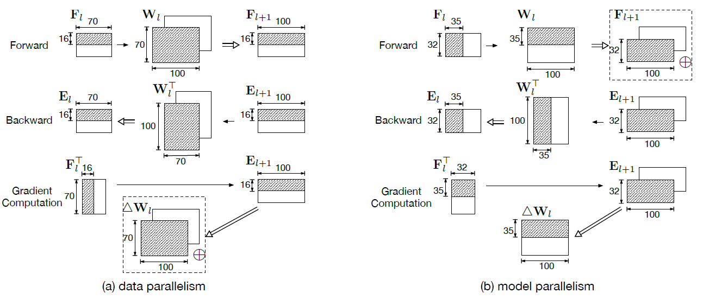

# Hybrid-Parallelism
Just for fun, experimental codes~

data parallelism & model parallelism:

Reference: [HyPar: Towards Hybrid Parallelism for Deep Learning Accelerator Array](https://arxiv.org/abs/1901.02067)

## Pytorch Experitments

* [HyPar-Conv2D-Multi-GPU-Pytorch](HyPar-Conv2D-Multi-GPU-Pytorch.ipynb)